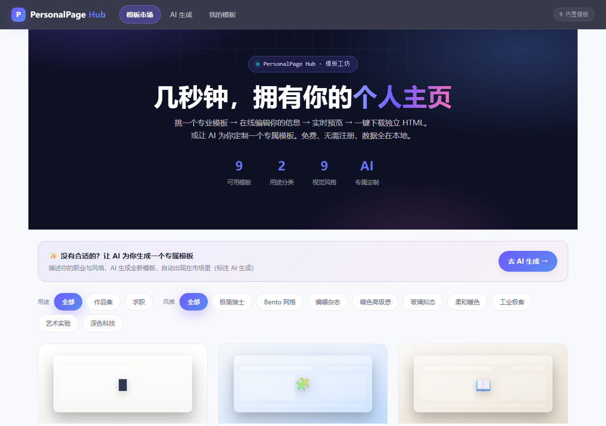
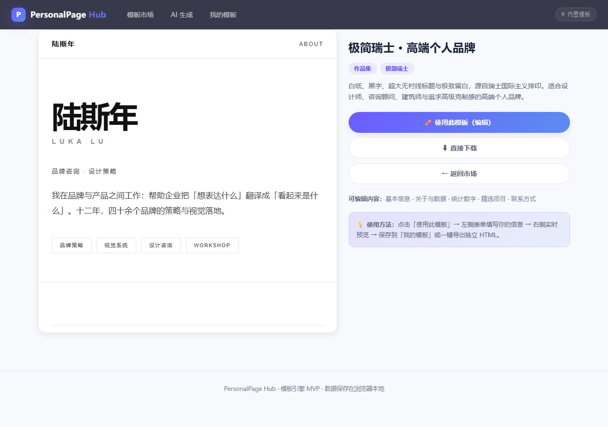
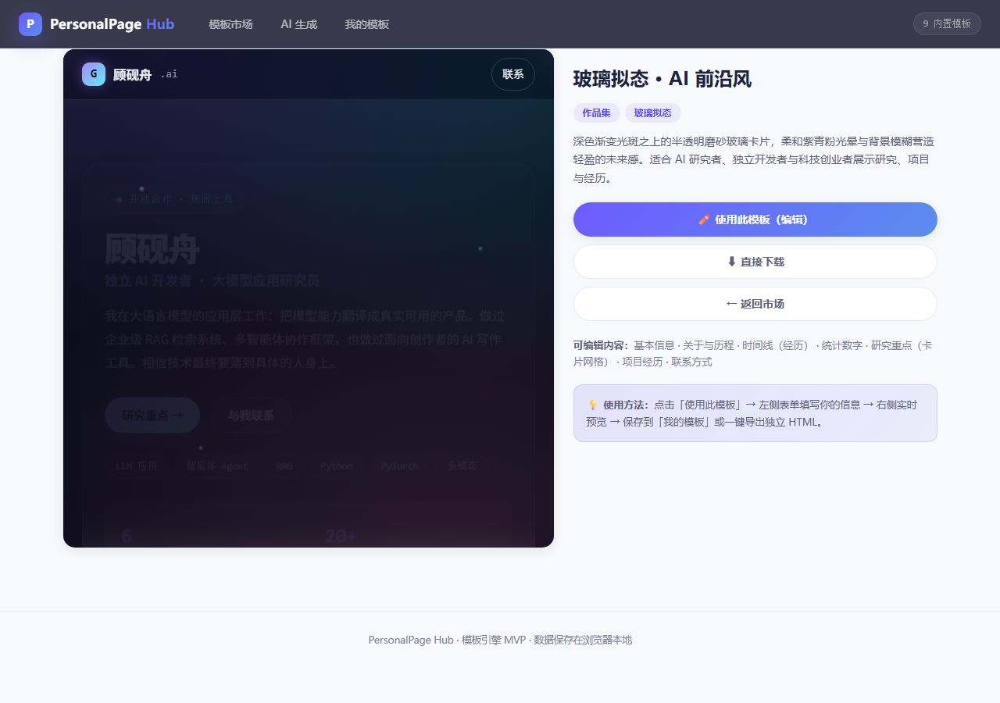

<div align="center">

# 🎨 PersonalPage Hub

### 个人网页模板工坊 —— 9 大设计风格 + AI 定制生成，3 分钟拥有高级感个人主页

[](LICENSE)
[](#-模板库)
[](https://react.dev)
[](#-ai-自定义生成)

**挑模板 → 在线编辑 → 实时预览 → 一键下载独立 HTML**。或者告诉 AI 你的职业与风格，让它为你定制一个专属模板。

</div>

---

## ✨ 它是什么

**PersonalPage Hub** 是一个纯前端、完全本地运行的**个人网页模板市场 + 生成器**：

- 🖼️ **模板市场**：9 种专业设计风格（极简瑞士 / Bento 网格 / 编辑杂志 / 暗色高级感 / 玻璃拟态 / 柔和暖色 / 工业极客 / 艺术实验 / 深色科技），每种都经过设计工作室级打磨
- ✏️ **可视化编辑**：schema 驱动的表单，改名字、简介、项目、技能、**头像与项目封面图**——右侧实时预览，无需写代码
- 🤖 **AI 定制生成**：填一段"我是谁"，DeepSeek 生成全新模板，自动出现在市场里
- 🔒 **沙箱隔离**：AI 生成的代码只在隔离 iframe 内运行，恶意模板也无法碰你的数据
- 🖋️ **真实字体渲染**：模板自托管 Inter / Space Grotesk / Poppins / JetBrains Mono（离线可用）+ 思源黑体/宋体兜底，中文排版按 CJK 纪律处理（标题 ≤80px、行高 1.15-1.25）
- 🖼️ **作品集表达力**：头像支持照片或抽象几何纹理；项目封面图可选（有图显示图片卡，无图优雅回退纯文字布局）
- ⬇️ **一键导出**：下载为独立 HTML（双击即用）或 JSON 备份，数据全在浏览器本地

## 🖼️ 演示

| 模板市场 | 极简瑞士风 | 玻璃拟态 |
|---|---|---|
|  |  |  |

## 🗂️ 模板库（9 大风格）

| 风格 | 模板 | 适合谁 |
|---|---|---|
| ⬜ 极简瑞士 | `minimal-swiss` | 设计师、咨询顾问、高端个人品牌 |
| 🧩 Bento 网格 | `bento-grid` | 开发者、产品经理、数据从业者 |
| 📖 编辑杂志 | `light-editorial` | 作家、记者、内容创作者、学术 |
| 🌃 暗色高级感 | `dark-premium` | 科技、游戏、酷感个人品牌 |
| 🧊 玻璃拟态 | `glassmorphism` | AI、前沿科技、未来感 |
| ☕ 柔和暖色 | `soft-warm` | 生活方式、咖啡、独立品牌 |
| ⌨️ 工业极客 | `industrial-geek` | 程序员、极客、硬件 |
| 🎨 艺术实验 | `art-experimental` | 艺术家、插画师、音乐人 |
| 🚀 深色科技 | `dark-tech` | 数据、云计算方向的求职者 |

每个模板都内置：**真实感人设示例文案、完整设计令牌（零裸色值）、双断点响应式、WCAG 对比度、reduced-motion 适配**。

## 🚀 快速开始

### 方式一：双击单文件版（零依赖）

仓库根目录的构建产物单文件版开箱即用（或本地构建后使用）：

```powershell
pnpm install      # 安装依赖
pnpm build        # 构建 → dist/ + PersonalPageHub-单文件版.html
pnpm preview      # 本地预览 http://localhost:4173
```

> 双击 `PersonalPageHub-单文件版.html` 即可离线使用全部功能。

### 方式二：开发模式

```powershell
pnpm install
pnpm dev          # 热更新开发，http://localhost:4173
```

### AI 生成（可选）

使用 AI 定制需要 DeepSeek API Key（[platform.deepseek.com](https://platform.deepseek.com) 创建）：
- Key 默认只存当前标签页（sessionStorage），勾选「记住」才持久化
- 前端直连 api.deepseek.com，不经过任何服务器

## 🧩 技术架构

```
模板引擎：template = { schema(字段定义) → 表单, defaults, render(data) → HTML, css }
                    │
                    ├─ 内置 9 模板（src/templates/*.js）
                    └─ AI 模板（产物 JSON 存 localStorage，加载时组装）
                    │
沙箱渲染：AI 模板的 renderBody 只在 sandbox iframe 内执行
          （blob + 内嵌数据 + 同步脚本），主线程永不 eval AI 代码
                    │
持久化：模板产物 localStorage · 我的模板 localStorage · Key sessionStorage
```

- **模板引擎**：`schema` 驱动通用编辑器自动生成表单，新增模板只需一个文件
- **沙箱安全**：危险全局黑名单 + 原型链拦截 + opaque origin 隔离，恶意模板碰不到 API Key
- **损坏处理**：打不开的模板自动隐藏 + 一键清理 + 详情页删除入口

## 📦 部署

纯静态站 + hash 路由，任何静态托管零配置：

```powershell
pnpm build        # 构建 dist/
```

部署到 GitHub Pages / Vercel / Netlify / Gitee Pages 均可，详见 [部署指南](部署指南.md)。

## ⚖️ 版权与许可

本项目采用 **GPL-3.0** 许可（[LICENSE](LICENSE)）：

- ✅ 你可以**学习、修改、个人使用**本项目
- ✅ 你可以**分发**本项目及衍生作品
- ❌ 基于本项目的**衍生作品必须同样以 GPL-3.0 开源**，并保留原始版权声明
- ❌ **不允许闭源使用/商用本项目代码**而不开源你的修改

这意味着：任何人都可以借鉴和学习，但**把你的作品拿去闭源打包、抹掉署名再发布是不被允许的**。

© 2026 PersonalPage Hub 作者。保留所有权利按 GPL-3.0 条款授予。

## 🗺️ 路线图

- [x] 模板市场 + 预览 + 下载
- [x] 可视化编辑器（schema 驱动）
- [x] AI 定制生成（DeepSeek）
- [x] 9 大设计风格模板库
- [x] 沙箱隔离（AI 代码不可逃逸）
- [ ] 更多风格变体（深/浅双主题）
- [ ] 模板收藏 / 分享链接
- [ ] 移动端体验打磨

## 🤝 贡献

欢迎提交 Issue 与 PR：新增风格模板、优化编辑器、改进 AI 提示词、修复问题。

---

<div align="center"><sub>Made with ❤️ · 数据 100% 本地 · 无跟踪无广告</sub></div>
